# Purchasing Power Parity (PPP)

Purchasing power parity is an economics concept in which there is a theoretical exchange rate that allows you to buy the same amount of goods and services in every country. For example, you should be able to buy a can of pepsi in Canada, and then fly to lets say Egypt, and after converting your Canadian dollars to Egyptian pounds, buy a can of pepsi at the same worth of currency that was paid in Canada. However, this is not the case, and there are many external factors that affect this. Therefore, I decided to dig a little deeper into the prices of gasoline around the world.

# Why Gasoline?

In an era where transportation is a necessity, gasoline serves to be an important unavoidable cost of transportation. The motivation behind the selection of gasoline stems from my experiences over the past couple of years. As a university student, money is scarce and valuable. Therefore, I attempted to prevent my downfall into debt via means of a budget. Through the first couple of months of budgetting I came to the realization as to what most of my money is going towards, and you can probably guess what it is based on the title of this website. That's right! Gasoline!! For that reason I wanted to base my project on the price of gas worldwide, to possibly see if I should be living in a different part of the world, and not Canada. 

# The Index 

The creation of the index required me to implement a 7 step process.

## 1. Scrape all the necessary data from the sources

All the necessary data was scraped into different tables from each source:
- Data on worldwide gas prices -> gas_prices: https://www.numbeo.com/cost-of-living/prices_by_country.jsp?itemId=24&displayCurrency=CAD
- Data on currency codes -> currency_codes: https://www.iban.com/currency-codes
- Data on GST -> taxes_table: taxes.csv
- Data on exchange rates -> exchange_rates: https://www.tpsgc-pwgsc.gc.ca/cgi-bin/recgen/er.pl?Language=E
- Data on currency symbols -> symbols: https://www.eurochange.co.uk/travel/tips/world-currency-abbreviations-symbols-and-codes-travel-money

## 2. Tidying Each Table & Adding it to main gas_prices Table

The tables were combined in the following order, and the overall main table was called gas_prices. That is why some columns that were used to add certain tables are not found on the original gas_prices table but on all the tables combined up to that point.

### Gas Prices Table
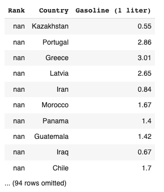
- The only tidying required for the initial gas_prices table was dropping the "Rank" column, and renaming the "Gasoline (1 liter)" column to "Price (CAD)"

### Currency Codes Table
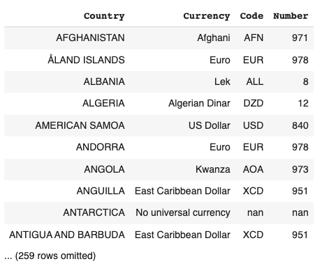
1. In order to add the currency_codes table to the gas_prices table, the "Country" column had to be changed from all uppercase to only capitalized. 
2. Then the table was joined with the gas_prices table using the two "Country" columns.
3. Finally, the useless columns were dropped ("Currency", "Number"). 

### Symbols Table
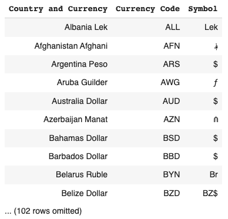
- The only tidying required for the initial symbols table was joining the table with the gas_prices table using the "Code" and "Currency Code" columns, and then dropping the column "Country and Currency".

### Taxes Table 
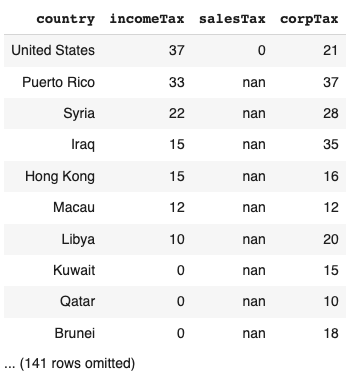
1. The taxes_table was joined to the gas_prices table using the "country" and "Country" columns.
2. To tidy the table, the columns "incomeTax" and "corpTax" were dropped.
3. The "salesTax" column was renamed to "GST".
4. Finally, the values in the "GST" column were converted from a whole number (percentage) to a decimal that could be used for calculations

### Exchange Rates Table 
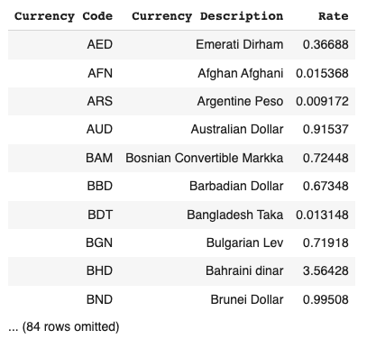
1. The exchange_rates table was added to the gas_prices table using the columns "Code" and "Currency Code".
2. Furthermore, the "Currency Description" column was also dropped to tidy up the final table. 

### Final Table 
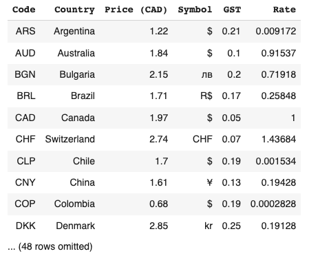

## 3. Add Columns to the Table of the Necessary Data required to Generate Graphs. 

1. Price (Country Currency including Tax) Column. 
- This column was generated with the use of the "Price (CAD)", "GST", and "Rate" columns. 
- The values in this column are the Price (CAD) converted to each corresponding country's currency using the Rate, and finally factoring in each GST before finalizing the values.
- The following image is the code that was used in the generation of this column.
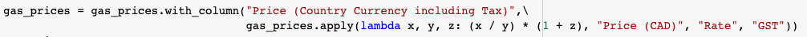

2. Price (CAD including Tax) Column. 
- This column was generated with the use of the "Price (Country Currency including Tax)", and "Rate" columns. 
- The values in this column are the Price (Country Currency including Tax) column with the values converted back into CAD using the different rates.
- The following image is the code that was used in the generation of this column. 
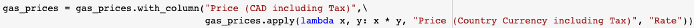

3. Difference Column. 
- This column was generated with the use of the "Price (CAD including Tax)" column. 
- The values in this column are the Price (CAD including Tax) of each country subtracting the Price (CAD including Tax) of Canada.
-The following image is the code that was used in the generation of this column.
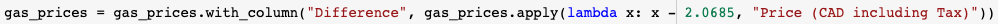

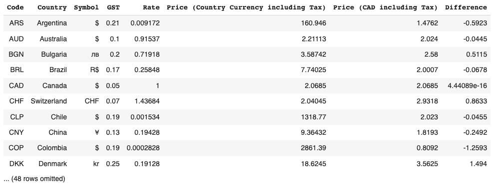

## 4. Plot The Differences

I chose to plot both the "positive" and "negative" differences differently for ease of comparison. The various bar charts were generated using the barh method on the gas_prices table, specifically the "Difference" column. 

As depicted by the data above, the two countries out of the dataset where the gasoline prices are the highest are Finland and Greece. The price of gas in these countries are $1.85 and $1.66 per liter respectively more expensive than Canada. On the other hand, the two countries out of the dataser where the gasoline prices are the lowest are Nigeria and Egypt. The price of gas in these countries are $1.51 and $1.48 per liter respectively less expensive than Canada.

## 5. Scrape Vehicle Data & Add it to the Table 

In an attempt to gain some insight as to why these countries had these gas prices, I gathered some data on vehicles per 1,000 people in each country, where available, from countries around the world. The data was obtained from https://en.wikipedia.org/wiki/List_of_countries_by_vehicles_per_capita. The logic behind gathering this data was to see if the number of vehicles in each country affected the price of gasoline. According to the laws of supply and demand, if there is more demand for gasoline, then the prices of gasoline increases. Therefore, countries with more vehicles would have more expensive gasoline. In order to test this, I generated a bar chart of vehicles in each country. However, before that, some data cleaning had to occur. 
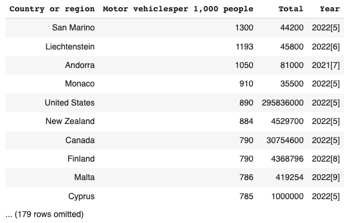

### Data Cleaning 
1. The vehicles table was joined with the gas_prices table with the use of the "Country" and "Country or region" columns. 
2. The "Total" and "Year" columns were dropped.
3. Finally, the "Motor vehiclesper 1,000 people" column was renamed to "Vehicles/1,000 People"

## 6. Plot the Vehicles

Plots of the number of vehicles per 1,000 people in each country separated by price differences 

According to the graphs above, we can see that overall the countries with negative price differences do have less vehicles than the countries with positive price differences, but the theory doesn't hold true for each individual country. For example, Germany has more vehicles than Greece, but cheaper gas prices. A correlation cannot be concluded from these graphs. Therefore, we can generate scatter plots to check out the correlation between the variables. 

## 7. Determine the Correlation 

### Positive Difference 

After analyzing the plot above, and using the correlation function, we can see that the positive price difference and vehicles per 1,000 people are not correlated. They have a correlation value of 0.02.

### Negative Difference 

After analyzing the plot above, and using the correlation function, we can see that the negative price difference and vehicles per 1,000 people are correlated more than positive price difference and vehicles per 1,000 people, but still not correlated enough to confirm a correlation. They have a correlation value of 0.27.

# Conclusion 

To conclude, I learned that if you are ever on vacation in Finland, it would be best to not rent a car, but to use public transportation instead. Furthermore, the gas prices in Nigeria are so cheap that I wish I was attending the University of Nigera rather than the UofA. Interestingly, I learned that the amount of vehicles does not impact the price of gasoline, but there is a correlation that the countries with positive price differences (more expensive than Canada) overall had more vehicles than the countries with negative price differences (less expensive than Canada).

## Sidenote...

After looking at the Positive Price Differences bar chart, I notice that quite a few of the countries were European. Therefore, to investigate this further, I decided to plot the data on a map. In order to do this, I received the Latitudes and Longitudes of each country using a table that was already provided earlier during the mapping lecture and added them to the table. The table was then cleaned by dropping the unnecessary columns. I also added another column that assigned a color value depending on where the price difference was positive or negative (positive = red, negative = green). The data was the plotted on a map and the results were interesting. 

The majority of the red pins were found in Europe, while the green pins were all outside of Europe. I wonder why that is.

#### Citations 
1. https://en.wikipedia.org/wiki/Purchasing_power_parity
2. https://en.wikipedia.org/wiki/Supply_and_demand
